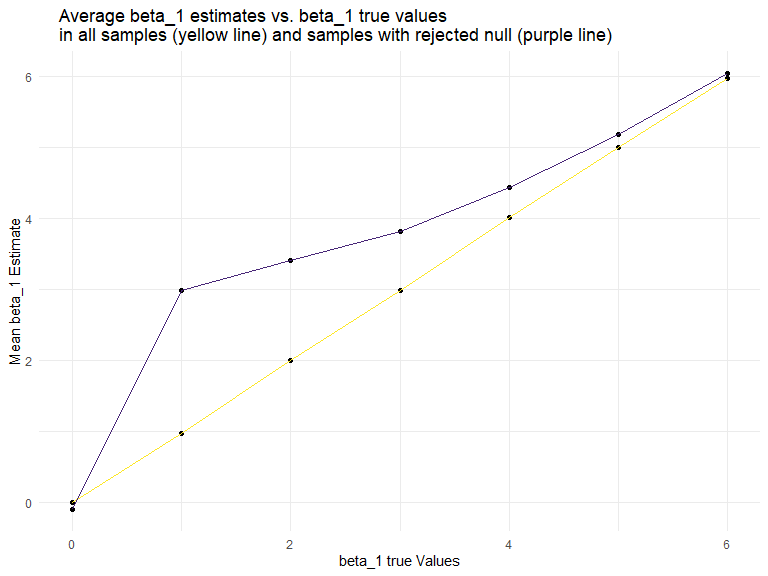

p8105\_hw5\_ha2546
================
Hana Akbarnejad
11/3/2019

## Problem 1

``` r
head(iris, 5)
```

    ##   Sepal.Length Sepal.Width Petal.Length Petal.Width Species
    ## 1          5.1         3.5          1.4         0.2  setosa
    ## 2          4.9         3.0          1.4         0.2  setosa
    ## 3          4.7         3.2          1.3         0.2  setosa
    ## 4          4.6         3.1          1.5         0.2  setosa
    ## 5          5.0         3.6          1.4         0.2  setosa

``` r
set.seed(10)

iris_with_missing = iris %>% 
  map_df(~replace(.x, sample(1:150, 20), NA)) %>%
  mutate(Species = as.character(Species))
```

*iris* is a dataset that contains 150 observations of 3 different flower
species: setosa, versicolor, virginica. It stores information in 5
variables about flowers: species, sepal length and width, and petal
length and width. First, I chose a sample of 20 from these 150
obserations, and eplaced them with NA. I also converted the species
factor variable to numeric.

``` r
replace_NA_fnc = function(vect){
  
  if(!is.character(vect) & !is.numeric(vect)){
    stop("This function only works on numeric and character vectors")
  } else if(is.character(vect)){
    replace_na(vect, "virginica")
  } else if (is.numeric(vect)) {
    replace_na(vect, mean(vect, na.rm = TRUE))
  }
  
}


iris_output = map(iris_with_missing, replace_NA_fnc) %>%  as_tibble() 
head(iris_output, 5)
```

    ## # A tibble: 5 x 5
    ##   Sepal.Length Sepal.Width Petal.Length Petal.Width Species
    ##          <dbl>       <dbl>        <dbl>       <dbl> <chr>  
    ## 1          5.1         3.5          1.4        0.2  setosa 
    ## 2          4.9         3            1.4        0.2  setosa 
    ## 3          4.7         3.2          1.3        0.2  setosa 
    ## 4          4.6         3.1          1.5        1.19 setosa 
    ## 5          5           3.6          1.4        0.2  setosa

## Problem 2

This problem focuses on control and experimental files for 10 subjects,
each contain longitudinal data over a 8-week period.

First, we want to import these files’ information in a data frame.

``` r
long_data = tibble (
  file_names = list.files(path = "data")
) %>% 
  mutate(
  ourput = map(.x = file_names, ~read_csv(str_c("data/", .x)))
  ) %>% 
  unnest()
```

Data tidying process:

``` r
long_data_tidy = long_data %>% 
  separate(file_names, c("arm", "case_ID")) %>% 
  pivot_longer(
    week_1:week_8,
    names_to = "week",
    values_to = "value",
    names_prefix = "week_"
  ) %>% 
  rename(group = arm) %>%
  mutate(
    group = factor(group, levels = c("con", "exp"), labels = c("control", "experimental")),
    week = factor(week, ordered = TRUE),
    case_ID = factor(case_ID)
  )
```

To clean the data, I seperated case column to two columns (one for arm
and one for subject ID). I also made the data frame longer, creating a
new variable for week number, and cleaned the names. Then I created
factor variables.

In the next step, I created a plot that shows how the trends of weekly
values differ in control and experimental groups (demonstrating all 10
individual cases). I used a spaghetti plot to show the
differences:

``` r
spaghetti_plot = ggplot(data = long_data_tidy, aes(x = week, y = value, color = group)) +
  geom_point(data = subset(long_data_tidy, group %in% c("control","experimental"))) +
  geom_line(data=subset(long_data_tidy, group == "control"), aes(group=case_ID, color = group)) +
  geom_line(data=subset(long_data_tidy, group == "experimental"), aes(group=case_ID, color = group)) +
  labs(
    x = "Week",
    y = "Observed Value",
    color = "Group",
    title = "Observed Values over Weeks in Control vs. Experimental Groups"
  ) +
  theme_classic()

spaghetti_plot
```


As it can be observed in this plot, in the cotrol group, the observed
value of each individual goes up and down but the overall trend stays
ina range and is not increasing or decreasing (no linear trend).
However, in the experimental group the overall change in subjects show a
general upgrowing trend. Additionally, the total average of experimental
group has been higher than control group through weeks and this
difference gets greater as we proceed through weeks.

## Problem 3

In this problem, I wrote a simple linear regression model function that
accounts for different fixed and non-fixed parameters. I extracted and
saved beta1\_hat and p\_value values, ran the simulation 10,000 times
for different true beta\_1 values, and saved the results

``` r
sim_regression = function (n = 30, beta0 = 2, beta1) {
  
  sim_data = tibble(
    x = rnorm(n, mean = 0, sd = 1),
    y = beta0 + beta1 * x + rnorm(n, mean = 0, sd = sqrt(50))
  )
  
  ls_fit = lm(y ~ x, data = sim_data) %>% 
    broom::tidy()
  
  tibble(
    beta1_hat = ls_fit[[2,2]],
    p_value = ls_fit[[2,5]]
  )
  
}

sim_results = 
  tibble(beta1_values = c(0, 1, 2, 3, 4, 5, 6)) %>% 
  mutate(
    output_lists = map(beta1_values, ~rerun(10000, sim_regression(beta1 = .x))),
    estimate_dfs = map(output_lists, bind_rows)
  ) %>% 
  select(-output_lists) %>% 
  unnest(estimate_dfs)
```

Then, I made a bar plot showing the relationship between the effect size
(beta1 true values) and the power of the test.

``` r
power_effect_plot = sim_results %>% 
  group_by(beta1_values) %>% 
  summarize(
    reject_null = sum(p_value < 0.05),
    n = n(),
    proportion = reject_null/n
  ) %>% 
  mutate (
    beta1_values = factor(beta1_values)
  ) %>% 
  ggplot(aes(x = beta1_values, y = proportion, color = beta1_values, fill = beta1_values)) +
  geom_bar(stat="identity") +
  labs(
    x= "Beta_1 True Values",
    y = "Power(Proportion of Rejected Null)",
    title = NULL,
    caption = NULL
  ) 

power_effect_plot 
```


It can be be observed that by increasing the effect size (the true value
of beta\_1), the power of the test increases. This observation aligns
with what we expect since when going away from the null hypothesis
(beta\_1 = 0), it is more probable that we get a lower p\_value and
reject the null correctly when the null hypothesis is false.

On the next step, I want to see the relationship between average
estimate of beta\_1 and the true value of beta\_1. I would like to
observe how this relationship changes when considering the whole sample,
and when considering only the ones in which the null hypothesis has been
rejected.

``` r
df1 = sim_results %>%                             # defining a dataframe, summarizing all beta_1 hat mean
  group_by(beta1_values) %>%
  summarize(
    beta1_hat_mean = mean(beta1_hat)
  )

df2 = sim_results %>%                             # definig a dataframe, summarizing beta_1 hat mean
  filter(p_value < 0.05) %>%                      # samples with rejected null
  group_by(beta1_values) %>%
  summarize(
    beta1_hat_mean = mean(beta1_hat)
  )

comparison_plot = ggplot() +                      # using above dataframes to overlay two plots showing the trends
  geom_point(data = df1, aes(x = beta1_values, y = beta1_hat_mean)) +
  geom_line(data = df1, aes(x = beta1_values, y = beta1_hat_mean), color = "#FDE725FF") +
  geom_point(data = df2, aes(x = beta1_values, y = beta1_hat_mean)) +
  geom_line(data = df2, aes(x = beta1_values, y = beta1_hat_mean), color = "#482677FF") +
  labs(
    title = "    Average beta_1 estimates vs. beta_1 true values
    in all samples (yellow line) and samples with rejected null (purple line)",
    x = "beta_1 true Values",
    y = "Mean beta_1 Estimate",
    caption = NULL
  )

comparison_plot
```



We previousely noted that by increasing the effect size, the power
increases. This means that a higher proportion of sample get rejected
when they have to be rejected which results in decrease in the
proportion of those cases in the overall sample in which the null **has
not been rejected**. This is the reason that in this plot, we observe
the difference between two lines decreases as the effect size increases;
because there are fewer unrejected cases left. The same reason justifys
why we observe the highest diffetence in beta\_1 = 1 case, since the
effect size is small and halph of the cases which should be rejected
stay unrejected. This trend is observed because instead of taking random
samples, we are choosing the ones with p\_value \< 0.05, so the result
we get is not unbiased anymore.
