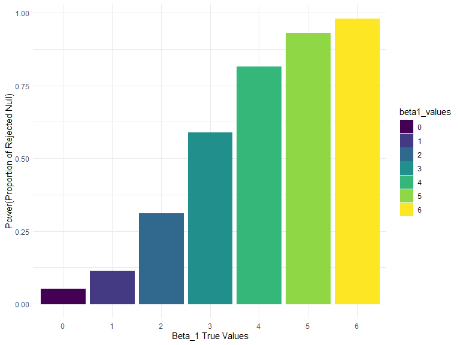

p8105\_hw5\_ha2546
================
Hana Akbarnejad
11/3/2019

## Problem 1

``` r
head(iris, 5)
```

    ##   Sepal.Length Sepal.Width Petal.Length Petal.Width Species
    ## 1          5.1         3.5          1.4         0.2  setosa
    ## 2          4.9         3.0          1.4         0.2  setosa
    ## 3          4.7         3.2          1.3         0.2  setosa
    ## 4          4.6         3.1          1.5         0.2  setosa
    ## 5          5.0         3.6          1.4         0.2  setosa

``` r
set.seed(10)

iris_with_missing = iris %>% 
  map_df(~replace(.x, sample(1:150, 20), NA)) %>%
  mutate(Species = as.character(Species))
```

*iris* is a dataset that contains 150 observations of 3 different flower
species: setosa, versicolor, virginica. It stores information in 5
variables about flowers: species, sepal length and width, and petal
length and width. First, I chose a sample of 20 from these 150
obserations, and eplaced them with NA. I also converted the species
factor variable to numeric.

``` r
replace_NA_fnc = function(vect){
  
  if(!is.character(vect) & !is.numeric(vect)){
    stop("This function only works on numeric and character vectors")
  } else if(is.character(vect)){
    replace_na(vect, "virginica")
  } else if (is.numeric(vect)) {
    replace_na(vect, mean(vect, na.rm = TRUE))
  }
  
}


iris_output = map(iris_with_missing, replace_NA_fnc) %>%  as_tibble() 
```

## Problem 2

This problem focuses on control and experimental files for 10 subjects,
each contain longitudinal data over a 8-week period.

First, we want to import these files’ information in a data frame.

``` r
long_data = tibble (
  file_names = list.files(path = "data")
) %>% 
  mutate(
  ourput = map(.x = file_names, ~read_csv(str_c("data/", .x)))
  ) %>% 
  unnest()
```

    ## Parsed with column specification:
    ## cols(
    ##   week_1 = col_double(),
    ##   week_2 = col_double(),
    ##   week_3 = col_double(),
    ##   week_4 = col_double(),
    ##   week_5 = col_double(),
    ##   week_6 = col_double(),
    ##   week_7 = col_double(),
    ##   week_8 = col_double()
    ## )
    ## Parsed with column specification:
    ## cols(
    ##   week_1 = col_double(),
    ##   week_2 = col_double(),
    ##   week_3 = col_double(),
    ##   week_4 = col_double(),
    ##   week_5 = col_double(),
    ##   week_6 = col_double(),
    ##   week_7 = col_double(),
    ##   week_8 = col_double()
    ## )
    ## Parsed with column specification:
    ## cols(
    ##   week_1 = col_double(),
    ##   week_2 = col_double(),
    ##   week_3 = col_double(),
    ##   week_4 = col_double(),
    ##   week_5 = col_double(),
    ##   week_6 = col_double(),
    ##   week_7 = col_double(),
    ##   week_8 = col_double()
    ## )
    ## Parsed with column specification:
    ## cols(
    ##   week_1 = col_double(),
    ##   week_2 = col_double(),
    ##   week_3 = col_double(),
    ##   week_4 = col_double(),
    ##   week_5 = col_double(),
    ##   week_6 = col_double(),
    ##   week_7 = col_double(),
    ##   week_8 = col_double()
    ## )
    ## Parsed with column specification:
    ## cols(
    ##   week_1 = col_double(),
    ##   week_2 = col_double(),
    ##   week_3 = col_double(),
    ##   week_4 = col_double(),
    ##   week_5 = col_double(),
    ##   week_6 = col_double(),
    ##   week_7 = col_double(),
    ##   week_8 = col_double()
    ## )
    ## Parsed with column specification:
    ## cols(
    ##   week_1 = col_double(),
    ##   week_2 = col_double(),
    ##   week_3 = col_double(),
    ##   week_4 = col_double(),
    ##   week_5 = col_double(),
    ##   week_6 = col_double(),
    ##   week_7 = col_double(),
    ##   week_8 = col_double()
    ## )
    ## Parsed with column specification:
    ## cols(
    ##   week_1 = col_double(),
    ##   week_2 = col_double(),
    ##   week_3 = col_double(),
    ##   week_4 = col_double(),
    ##   week_5 = col_double(),
    ##   week_6 = col_double(),
    ##   week_7 = col_double(),
    ##   week_8 = col_double()
    ## )
    ## Parsed with column specification:
    ## cols(
    ##   week_1 = col_double(),
    ##   week_2 = col_double(),
    ##   week_3 = col_double(),
    ##   week_4 = col_double(),
    ##   week_5 = col_double(),
    ##   week_6 = col_double(),
    ##   week_7 = col_double(),
    ##   week_8 = col_double()
    ## )
    ## Parsed with column specification:
    ## cols(
    ##   week_1 = col_double(),
    ##   week_2 = col_double(),
    ##   week_3 = col_double(),
    ##   week_4 = col_double(),
    ##   week_5 = col_double(),
    ##   week_6 = col_double(),
    ##   week_7 = col_double(),
    ##   week_8 = col_double()
    ## )
    ## Parsed with column specification:
    ## cols(
    ##   week_1 = col_double(),
    ##   week_2 = col_double(),
    ##   week_3 = col_double(),
    ##   week_4 = col_double(),
    ##   week_5 = col_double(),
    ##   week_6 = col_double(),
    ##   week_7 = col_double(),
    ##   week_8 = col_double()
    ## )
    ## Parsed with column specification:
    ## cols(
    ##   week_1 = col_double(),
    ##   week_2 = col_double(),
    ##   week_3 = col_double(),
    ##   week_4 = col_double(),
    ##   week_5 = col_double(),
    ##   week_6 = col_double(),
    ##   week_7 = col_double(),
    ##   week_8 = col_double()
    ## )
    ## Parsed with column specification:
    ## cols(
    ##   week_1 = col_double(),
    ##   week_2 = col_double(),
    ##   week_3 = col_double(),
    ##   week_4 = col_double(),
    ##   week_5 = col_double(),
    ##   week_6 = col_double(),
    ##   week_7 = col_double(),
    ##   week_8 = col_double()
    ## )
    ## Parsed with column specification:
    ## cols(
    ##   week_1 = col_double(),
    ##   week_2 = col_double(),
    ##   week_3 = col_double(),
    ##   week_4 = col_double(),
    ##   week_5 = col_double(),
    ##   week_6 = col_double(),
    ##   week_7 = col_double(),
    ##   week_8 = col_double()
    ## )
    ## Parsed with column specification:
    ## cols(
    ##   week_1 = col_double(),
    ##   week_2 = col_double(),
    ##   week_3 = col_double(),
    ##   week_4 = col_double(),
    ##   week_5 = col_double(),
    ##   week_6 = col_double(),
    ##   week_7 = col_double(),
    ##   week_8 = col_double()
    ## )
    ## Parsed with column specification:
    ## cols(
    ##   week_1 = col_double(),
    ##   week_2 = col_double(),
    ##   week_3 = col_double(),
    ##   week_4 = col_double(),
    ##   week_5 = col_double(),
    ##   week_6 = col_double(),
    ##   week_7 = col_double(),
    ##   week_8 = col_double()
    ## )
    ## Parsed with column specification:
    ## cols(
    ##   week_1 = col_double(),
    ##   week_2 = col_double(),
    ##   week_3 = col_double(),
    ##   week_4 = col_double(),
    ##   week_5 = col_double(),
    ##   week_6 = col_double(),
    ##   week_7 = col_double(),
    ##   week_8 = col_double()
    ## )
    ## Parsed with column specification:
    ## cols(
    ##   week_1 = col_double(),
    ##   week_2 = col_double(),
    ##   week_3 = col_double(),
    ##   week_4 = col_double(),
    ##   week_5 = col_double(),
    ##   week_6 = col_double(),
    ##   week_7 = col_double(),
    ##   week_8 = col_double()
    ## )
    ## Parsed with column specification:
    ## cols(
    ##   week_1 = col_double(),
    ##   week_2 = col_double(),
    ##   week_3 = col_double(),
    ##   week_4 = col_double(),
    ##   week_5 = col_double(),
    ##   week_6 = col_double(),
    ##   week_7 = col_double(),
    ##   week_8 = col_double()
    ## )
    ## Parsed with column specification:
    ## cols(
    ##   week_1 = col_double(),
    ##   week_2 = col_double(),
    ##   week_3 = col_double(),
    ##   week_4 = col_double(),
    ##   week_5 = col_double(),
    ##   week_6 = col_double(),
    ##   week_7 = col_double(),
    ##   week_8 = col_double()
    ## )
    ## Parsed with column specification:
    ## cols(
    ##   week_1 = col_double(),
    ##   week_2 = col_double(),
    ##   week_3 = col_double(),
    ##   week_4 = col_double(),
    ##   week_5 = col_double(),
    ##   week_6 = col_double(),
    ##   week_7 = col_double(),
    ##   week_8 = col_double()
    ## )

``` r
long_data_tidy = long_data %>% 
  separate(file_names, c("arm", "case_ID")) %>% 
  pivot_longer(
    week_1:week_8,
    names_to = "week",
    values_to = "value",
    names_prefix = "week_"
  ) %>% 
  rename(group = arm) %>%
  mutate(
    group = factor(group, levels = c("con", "exp"), labels = c("control", "experimental")),
    week = factor(week, ordered = TRUE),
    case_ID = factor(case_ID)
  )
```

``` r
  ggplot(data = long_data_tidy, aes(x = week, y = value, color = group)) +
  geom_point(data = subset(long_data_tidy, group %in% c("control","experimental"))) +
  geom_line(data=subset(long_data_tidy, group == "control"), aes(group=case_ID, color = group)) +
  geom_line(data=subset(long_data_tidy, group == "experimental"), aes(group=case_ID, color = group)) +
  labs(
    x = "Week",
    y = "Observed Value",
    color = "Group",
    title = "Observed Values over Weeks in Control vs. Experimental Groups"
  ) +
  theme_classic()
```


As it can be observed in the spaghetti plot, in the cotrol group, the
observed value of each individual goes up and down but the trend is not
overallt increasing or decreasing. However, in the experimental group
the overall change in subjects show a general upgrowing trend.
Additionally, the total average of experimental group has been higher
than control group through weeks and this difference gets greater as we
proceed through weeks.

## Problem 3

``` r
sim_regression = function (n = 30, beta0 = 2, beta1) {
  
  sim_data = tibble(
    x = rnorm(n, mean = 0, sd = 1),
    y = beta0 + beta1 * x + rnorm(n, mean = 0, sd = sqrt(50))
  )
  
  ls_fit = lm(y ~ x, data = sim_data) %>% 
    broom::tidy()
  
  tibble(
    beta1_hat = ls_fit[[2,2]],
    p_value = ls_fit[[2,5]]
  )
  
}

sim_results = 
  tibble(beta1_values = c(0, 1, 2, 3, 4, 5, 6)) %>% 
  mutate(
    output_lists = map(beta1_values, ~rerun(10000, sim_regression(beta1 = .x)))
    ) %>% 
  unnest() %>% 
  unnest()
```

``` r
sim_results %>% 
  group_by(beta1_values) %>% 
  summarize(
    reject_null = sum(p_value < 0.05),
    n = n(),
    proportion = reject_null/n
  ) %>% 
  mutate (
    beta1_values = as.factor(beta1_values)
  ) %>% 
  ggplot(aes(x = beta1_values, y = proportion)) +
  geom_point() +
  scale_x_discrete(limits=c(0, 1, 2, 3, 4, 5, 6)) +
  labs(
    x= "Beta_1 Values",
    y = "Rejected Nulls Proportion (p_val < 0.05)",
    title = NULL,
    caption = NULL
  )
```


Describe the association between effect size and power.

``` r
# sim_results %>% 
#   group_by(beta1_values) %>% 
#   summarize(
#     beta1_hat_mean = mean(beta1_hat)
#   ) %>% 
#   ggplot(aes(x = beta1_values, y = beta1_hat)) +
#     geom_point() + geom_line()
```
